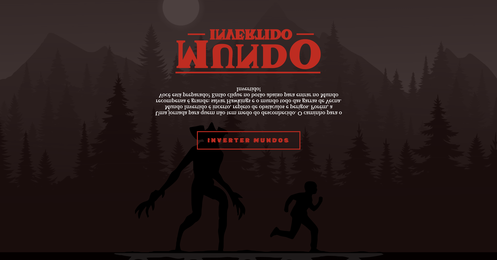

 

<h3 align="center">Mundo Invertido | Landing Page</h3>

Página feita para fins de estudo de HTML, CSS e Javascript na Semana Frontend da DIO.

# 📝 Tabela de Conteúdo
- [HTML](#html)
- [CSS](#css)
- [Javascript](#javascript)

## HTML 🧐 
 1. Estuturação de Página
 2. Semântica
 3. Acessibilidade
 4. Web Scraping
 5. SEO

## CSS 🎉
1. Posicionamentos
2. Pseudo-elementos
3. Pseudo-classes
4. Flexbox
5. Animações

## JavaScript 🏁 
1. Introdução ao Javascript
2. Manipulação da DOM
3. Introdução ao Firebase
4. Integração com o Firebase

Made by 👩🏾‍💻 <a href="https://linkedin.com/in/jessicacastros">Jessica Castro</a> with 💙
